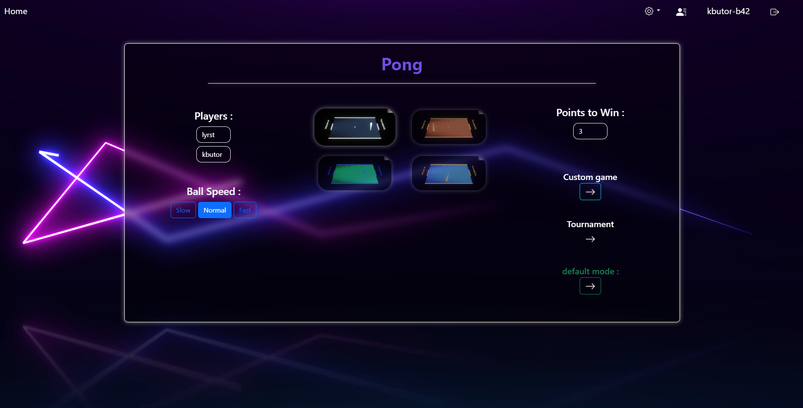
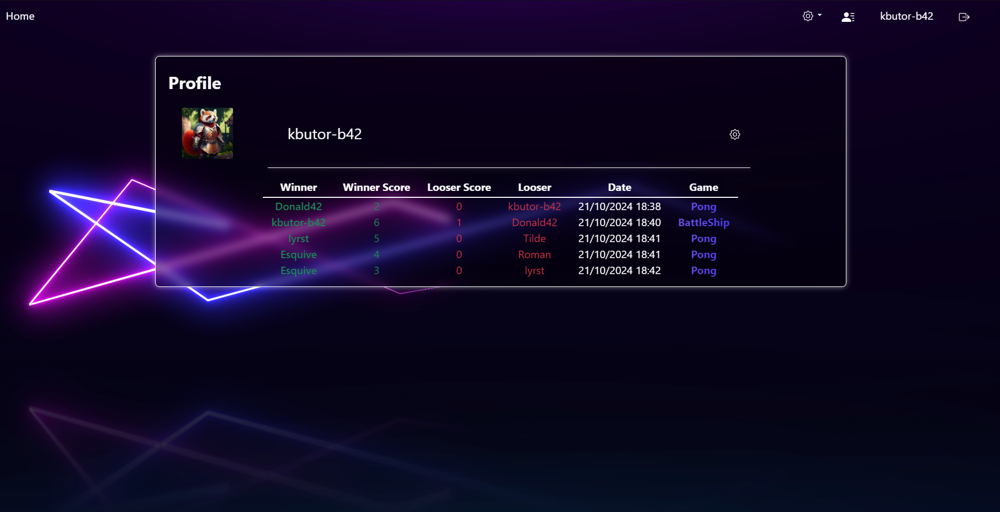
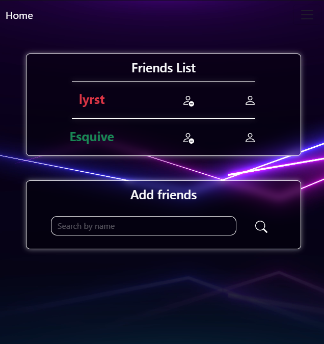

<!-- Improved compatibility of back to top link: See: https://github.com/othneildrew/Best-README-Template/pull/73 -->
<a name="readme-top"></a>
<!--
*** Thanks for checking out the Best-README-Template. If you have a suggestion
*** that would make this better, please fork the repo and create a pull request
*** or simply open an issue with the tag "enhancement".
*** Don't forget to give the project a star!
*** Thanks again! Now go create something AMAZING! :D
-->


<!-- PROJECT SHIELDS -->
<!--
*** I'm using markdown "reference style" links for readability.
*** Reference links are enclosed in brackets [ ] instead of parentheses ( ).
*** See the bottom of this document for the declaration of the reference variables
*** for contributors-url, forks-url, etc. This is an optional, concise syntax you may use.
*** https://www.markdownguide.org/basic-syntax/#reference-style-links
-->


<!-- PROJECT LOGO -->
<br />
<div align="center">
  <a href="https://github.com/othneildrew/Best-README-Template">
    
  </a>

  <h3 align="center">TRANSCENDANCE</h3>


</div>


<!-- TABLE OF CONTENTS -->
<details>
  <summary>Table of Contents</summary>
  <ol>
    <li>
      <a href="#about-the-project">About The Project</a>
    </li>
    <li>
      <a href="#getting-started">Getting Started</a>
      <ul>
        <li><a href="#installation">Installation</a></li>
      </ul>
    </li>
    <li><a href="#contact">Contact</a></li>
  </ol>
</details>


<!-- ABOUT THE PROJECT -->
## About The Project

This project is the last one of the 42's Common Core, our first web project in a FullStack application.

- **Django** : API RESTful for the backend.
- **PostgreSQL** : database.
- **Docker** : Docker with django / postgres / nginx.
- **Pure JS Router** : SPA features re-write in a PURE JS, as a mini-Angular.

This project main difficulty is about creating a **Single Page Application whithout a framework**, so in PURE JS, without libraries also.
I make this with a friend to help me, available in the front/web/spa folder, who works as a mini-Angular, with service and components, and it's use by the application in front/web/app for the project.

Since the project work with a mandatory part and a module system (we have the choice of the modules), here the module list we choose to our Transcendence:

|    |           Category           | Module | Point | status |
| :-----: | :--------------------------: | :----- | :------: | :----: |
| `Major` | Web - Backend                          | [Use a Framework as backend (django)] | 1 | &#9989; |
| `Minor` | Web - Frontend                          | [Use a front-end framework or toolkit (Bootstrap5)] | 0.5 |&#9989; |
| `Minor` | Web - Backend                          | [Use a database for the backend(Postgres)] | 0.5 |&#9989; |
| `Major` | User management                          | [Standard user management, authentication, users across tournaments] | 1 | &#9989; |
| `Major` | User management                          | [Implementing a remote authentication] | 1 | &#9989; |
| `Major` | Gameplay                          | [Remote players] | 1 | &#9989; |
| `Major` | Gameplay                          | [Multiplayers] | 1 | &#9989; |
| `Major` | Gameplay                          | [Add Another Game with User History and Matchmaking] | 1 | &#9989; |
| `Minor` | Gameplay                         | [Game Customization Options] | 0.5 | &#9989; |
| `Minor` | Accessibility                         | [Support on all devices] | 0.5 | &#9989; |
| `Minor` | Accessibility                         | [Expanding Browser Compatibility] | 0.5 | &#9989; |
| `Minor` | Accessibility                         | [Multiple language supports] | 0.5 | &#9989; |
| `Major` | Graphics                         | [ Use of advanced 3D techniques] | 1 |  &#9989; |
| `Major` | Cybersecurity | [ Implement Two-Factor Authentication (2FA) and JWT.] | 1 | &#9989; |

<!-- GETTING STARTED -->
## Some screenshots

### Customize your games
<p align="center">
    
</p>

### Profile with profile picture, match history,  and options with 2Fa or RGPD rights for example
<p align="center">
    
</p>

### The site is responsive ! (you have a friendlist btw)
<p align="center">
    
</p>

## Getting Started

### Prerequisites
- ports 8443 available

### Installation
1. Clone the repo
   ```sh
   git clone https://github.com/Lyyrst/Transcendance.git
2. Makefile !
   ```sh
   make
   ```
   or
   ```sh
   make re
   ```
4. [Head to the website !](https://localhost:8443)

<p align="right">(<a href="#readme-top">back to top</a>)</p>

<!-- CONTACT -->
## Contact

[Discord : lyrst](https://discord.com/users/257192704537001984)

kurt.butorp@gmail.com

## Reminder

Please remember that this project is one of the first I did as a computer science learner, it does not reflect my actual skills but through which project I learned programming.
